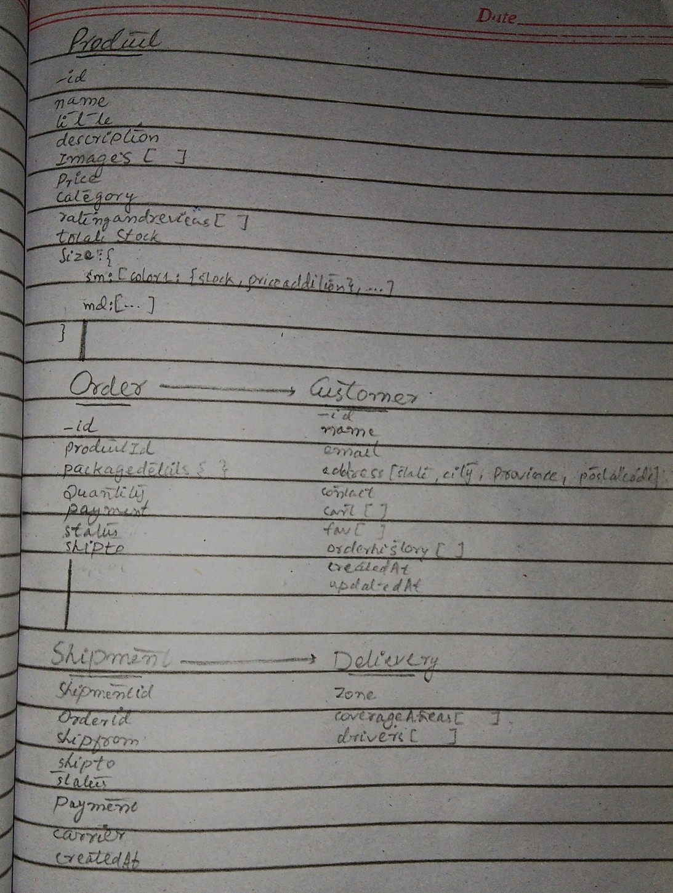

# DAY 1:

<h2>1. Marketplace Type</h2>

This project is going to serve general e-commerce (nieche e-commerce) narketplace

<h2>2. Buisness Goals</h2>

<ul>
    <li><b>What problem does our marketplace aim to solve?</b></li>
    We aim to provide a seamless and reliable online platform for purchasing authentic Nike products locally in Pakistan, with plans to expand globally to make shopping easier for everyone.
    <li><b>Who is our target audience?</b></li>
    Our target audience includes Nike enthusiasts, athletes, fitness enthusiasts, and anyone seeking premium sportswear and accessories in Pakistan.
    <li><b>What products and services we offer?</b></li>
    We offer a wide range of Nike products, including shoes, clothing, accessories, and exclusive collections, with a focus on authenticity and quality service.
    <li><b>Why choose us?</b></li>
    We guarantee authentic Nike products, a user-friendly shopping experience, and exceptional customer support, starting locally and scaling globally in the future.
</ul>

<h2>3. Data Schema</h2> 

