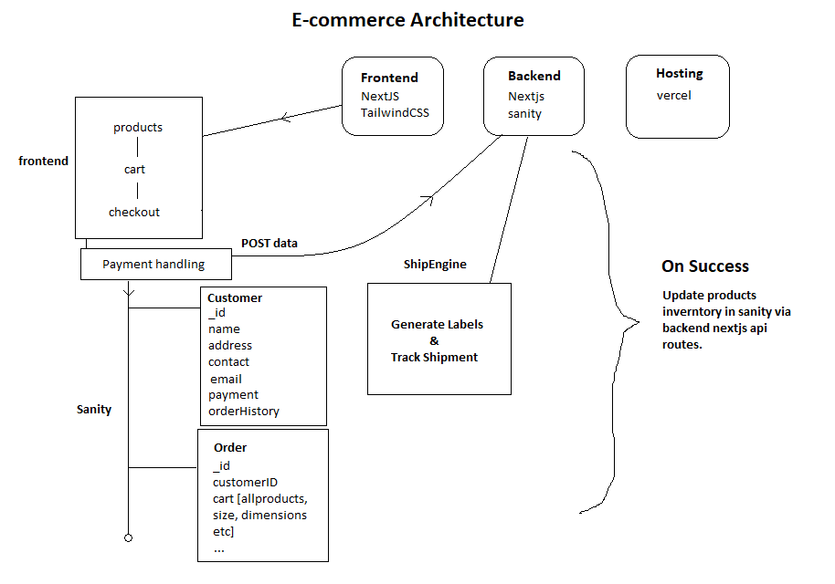

# DAY 2:

<h2>Architecture Components.</h2>
<h5>Frontend</h5>

<li>Framework: Next.js (React-based for Server-Side Rendering/Static Site Generation)</li>
<li>Styling: TailwindCSS for UI</li>
<li>CMS Integration: Fetch products from Sanity using its GROQ API</li>
<li>Checkout Form: Collect customer and order details</li>
<h5>Backend</h5>

<li>API Routes: Built-in Next.js API routes for handling:</li>
<li>Customer and order data storage in Sanity</li>
<li>Shipment label creation and tracking with ShipEngine</li>
<li>Sanity Client: To connect and interact with the Sanity dataset</li>
<li>ShipEngine API Integration: For handling shipment details</li>
<h5>Sanity (CMS + Database)</h5>

<li>Dataset: Store:</li>
<li>Product catalog (id, name, description, price, stock, images)</li>
<li>Orders (customer name, email, products ordered, shipping address)</li>
<li>Customer details (optional: for better reporting)</li>
<li>Use Sanity Studio for content management.</li>
<h5>ShipEngine</h5>

<li>Use ShipEngine for:</li>
<li>Generating shipping labels during checkout</li>
<li>Tracking shipments with generated labels</li>
<h5>Infrastructure</h5>

<li>Hosting: Vercel for Next.js app (frontend + backend)</li>
<li>Environment Variables: Store keys for Sanity and ShipEngine securely</li>

<h2>WorkFlow.</h2>

<h5>Product Management</h5>

<li>Admin uploads and manages products in Sanity Studio.</li>
<li>Product data (images, prices, stock, etc.) fetched via GROQ API and rendered on the website.</li>

<h5>Order Flow</h5>

<b>Frontend:</b>
<li>Customer adds products to a cart.</li>
<li>Checkout form collects customer details and shipping address.</li>
<b>Backend API:</b>
<li>Stores the customer and order data into Sanity.</li>
<li>Creates a shipping label and tracking information using ShipEngine.</li>

<h5>Shipment and Label</h5>

<li>Once checkout is submitted:</li>
<li>A shipment is created in ShipEngine using customer and product details.</li>
<li>The generated shipping label and tracking information are saved in Sanity with the order details.</li>
<li>Label details and tracking link sent to the customer via a thank-you page or email.</li>
<h5>Tracking</h5>

<li>Customers can track their shipment via a tracking URL from ShipEngine.</li>
 

<h1>Basic Architecture</h1>

