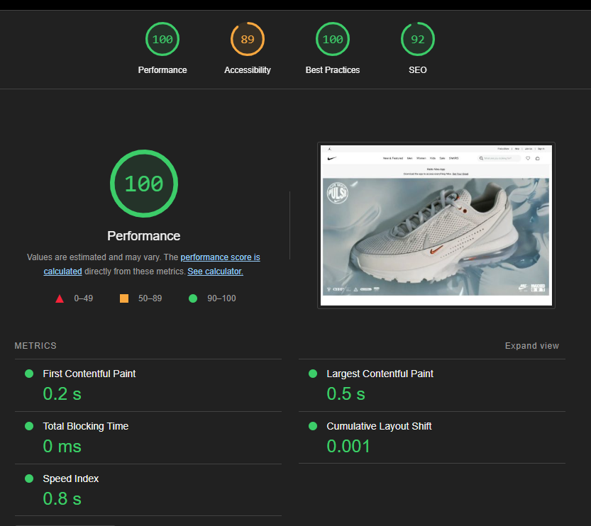

# Day 1: Laying the foundation

The first day focused on establishing our business objectives and identifying the target audience. Our aim was to build an e-commerce Nike store targeting local businesses in Pakistan, with the flexibility to scale in the future.

# Day 2: Planning the technical foundation

On day two, we finalized the technologies for our platform: Next.js, TailwindCSS, Sanity, ShipEngine, Auth.js, and Stripe. We also developed an initial schema, which has since evolved. While the project remains under active development, additional work is required to complete the shipment configuration.

# Day 3: API integration and data migration

Since this was a hackathon project, the provided data was supplied by our faculty. This data was successfully migrated to Sanity and integrated into the frontend for listing and presentation.

# Day 4: Building dynamic frontend key components

Day 4 focused on building essential components to enable a seamless e-commerce experience. This included an Admin Panel for managing orders and printing shipment labels, as well as a My Orders component for clients to track their purchases.

# Day 5: Testing & backend refinement

On the fifth day, we tested various aspects of the application, such as error handling in forms, product listings, dynamic pages, cart functionality and so on.

# Day 6: Staging and Performance Test 

on day 6 we stage our project and perform further test such as performance test and document the summary from day 1 - day 6

